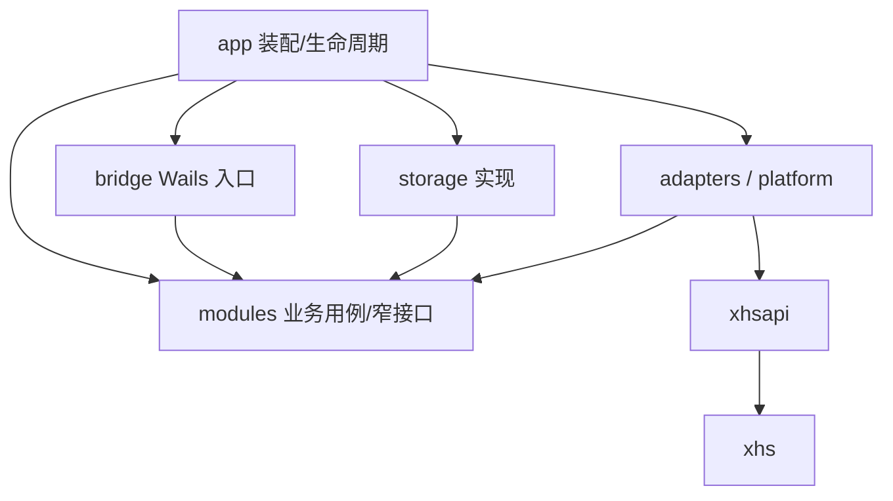

# 工程结构与职责

## 后端目标结构

以下是逐步落地的目标，未进入阶段的目录不创建空壳。保留根 `main.go`，兼容当前 Wails 构建和 `frontend/dist` 嵌入位置。

```text
desktop/
├── main.go                       # 嵌入资源、调用 app.Run、输出最终启动错误
├── go.mod / go.sum
├── Taskfile.yml
├── build/                        # Wails 构建、平台资源、应用元信息，需入库
├── cmd/
│   ├── xhscheck/                 # 保留现有账号验证工具
│   ├── xhsapitest/               # 保留响应采集和离线 Pretty 工具
│   └── desktopcheck/             # 后续：无 GUI 的存储/解析/下载故障验证工具
├── internal/
│   ├── app/
│   │   ├── run.go                # Wails 装配与窗口
│   │   ├── runtime.go            # Start/Close、资源容器、启动回滚
│   │   └── wiring.go             # 依赖构造，不放业务规则
│   ├── bridge/                   # Wails 可绑定入口；只适配 DTO/错误/服务调用
│   │   ├── lifecycle.go
│   │   ├── app_service.go
│   │   ├── account_service.go
│   │   ├── note_service.go
│   │   ├── download_service.go
│   │   ├── history_service.go
│   │   ├── settings_service.go
│   │   ├── file_service.go
│   │   ├── job_event_service.go
│   │   ├── dto/
│   │   └── events.go             # 唯一 Wails 事件出口
│   ├── modules/
│   │   ├── accounts/             # 账号模型、Cookie 验证、session 生命周期
│   │   ├── notes/                # 解析作业、分页、笔记/作者快照
│   │   ├── downloads/            # 一笔记一任务、笔记并发、下载项串行、配置/规划
│   │   ├── history/              # 笔记历史、下载项明细、文件验证、补缺判断
│   │   └── settings/             # 默认值、配置校验、版本升级
│   ├── storage/
│   │   ├── sqlite.go             # modernc 连接、PRAGMA、读写池
│   │   ├── migrate.go            # 版本、校验和、备份、事务迁移
│   │   ├── queries.go            # embed SQL 注册、固定查询/排序映射
│   │   ├── tx.go                 # 跨表原子操作
│   │   ├── account_repository.go
│   │   ├── note_repository.go
│   │   ├── parse_repository.go
│   │   ├── download_repository.go
│   │   ├── history_repository.go
│   │   ├── settings_repository.go
│   │   └── sql/
│   │       ├── migrations/       # 0001_initial.sql、0002_*.sql，发布后不可改
│   │       └── queries/
│   │           ├── accounts/
│   │           ├── notes/
│   │           ├── parsing/
│   │           ├── downloads/
│   │           ├── history/
│   │           └── settings/
│   ├── adapters/
│   │   ├── xhs/                 # 复用 xhsapi、DTO 映射、分页轻量条目适配
│   │   ├── mediahttp/           # 流式 CDN 请求、Range、备用地址；不同于 API transport
│   │   └── filesystem/          # 安全命名、临时文件、覆盖替换、文件校验
│   ├── platform/
│   │   ├── paths/              # 系统数据/日志/缓存目录
│   │   ├── secrets/            # Cookie 保护，首发 Windows DPAPI 适配
│   │   └── logging/            # slog、脱敏、轮转与关闭
│   ├── jobs/                   # 小型公共契约：JobID、进度 envelope、状态；不含所有业务
│   ├── xhs/                    # 既有算法与 API HTTP 核心，保持边界
│   └── xhsapi/                 # 既有 API 和媒体 Pretty，保持无应用依赖
├── frontend/                   # 见下方结构
└── docs/                       # 本计划与后续决策记录
```

每个业务模块以 `model.go`、`service.go`、`ports.go` 和必要实现文件组织；调度复杂后才拆独立子包。禁止为了分层把每个模型拆成单文件，或引入通用 ORM/万能 Repository。

## 依赖方向



- 业务模块声明所需窄接口，由存储/网络/文件适配实现；不引用 `application`、`database/sql` 或生成 bindings。
- `downloads` 可读取 `notes` 的快照模型，`history` 可读取下载结果模型，反向依赖禁止。账号访问通过 `accounts` 的 lease 契约，不把 Cookie 复制进任务。
- `history` 向下载器提供 `DuplicateChecker` 窄接口；接口和判断结果定义在消费方 `downloads/ports.go`，通过 app 注入实现，避免 downloads ↔ history 环。
- 下载模型为 `DownloadTask（单笔记）→ DownloadItem（有序下载项）`。批量来源是可选 DownloadBatch 分组；它不占并发槽、不拥有独立执行队列。下载项可以映射实际文件，但没有独立对外的下载任务身份。
- 下载项结算所需「item/attempt + 笔记任务进度/顺序 + 笔记历史/明细」原子提交，由 `DownloadRepository.CommitItemOutcome` 一次完成；业务不编排多个互相独立的 SQL 写操作。
- `jobs` 仅包含确实跨解析/下载共用的状态、ID 和事件契约；不成为全局业务模型仓库。
- 不创建隐式 package 全局 DB/client/scheduler；依赖从构造函数传入。允许小型组合结构，不要求所有内部函数都接口化。

## 前端目标结构

```text
frontend/
├── bindings/                    # Wails 生成，禁止手改；按现有生成流程管理
├── src/
│   ├── app/
│   │   ├── bootstrap.tsx        # 启动配置、错误边界、应用 ready 状态
│   │   ├── router.tsx           # createHashRouter、轻量路由树、route.lazy
│   │   ├── providers.tsx        # ConfigProvider / Ant App / QueryClientProvider
│   │   ├── shell/              # 导航、任务摘要、全局弹层宿主
│   │   ├── theme/              # int8 主题模式、系统订阅、design tokens
│   │   └── events/             # 全局唯一事件订阅、缓冲/同步/清理
│   ├── features/
│   │   ├── parsing/            # 输入、批量/用户模式、解析作业
│   │   ├── notes/              # 笔记列表、详情、媒体候选展示
│   │   ├── downloads/          # 下载配置、任务中心、实时进度 store
│   │   ├── accounts/           # Cookie 输入、验证、账号状态
│   │   ├── history/            # 查询、分组、文件定位、重下
│   │   └── settings/           # 全局参数、配置模板、主题
│   ├── shared/
│   │   ├── bridge/             # 唯一手写 bindings 调用封装、统一错误/取消处理
│   │   ├── components/         # 跨模块确实复用的 EmptyState、AsyncBoundary 等
│   │   ├── hooks/              # 少量通用 hooks，禁止业务逻辑大杂烩
│   │   ├── contracts/          # 生成 DTO/数字枚举导出、显示标签适配
│   │   ├── lib/                # 时间/大小/路径显示、query key 基础
│   │   └── styles/             # reset、全局布局 token、少量基础样式
│   └── main.tsx
├── package.json / pnpm-lock.yaml
└── vite.config.ts / tsconfig.json
```

feature 内按需使用 `route.tsx`、`components/`、`api.ts`、`queries.ts`、`hooks/`、`store.ts`；不机械创建空文件夹。页面只调用 feature API，feature API 经 `shared/bridge` 调用生成服务。禁止页面深层导入其他 feature 私有实现。

持久化查询用 TanStack Query，任务高频进度用小型 Zustand store，表单临时状态归组件。主题归 provider。相同数据只有一个权威来源，不将全库数据同时塞进 Query cache 和 store。

## 编码与契约约定

- 应用枚举显式声明 `type TaskState int8`，不用 `iota` 隐式重排已持久化值；每个封闭枚举 `0` 为 Unknown/Unspecified，输入时拒绝未知策略。
- ID 使用字符串；note/user 的上游 ID 原样保存。内部任务/文件 ID 使用 UUID/同等碰撞安全字符串，不把 SQL rowid 当跨层身份。
- DTO 时间戳为 JSON number，当前毫秒时间戳在 JS 安全范围内；大 ID 禁止通过 number。字节数采用 int64，传前端前检查安全整数范围。
- domain 的创建/更新时间均 `int64` 毫秒；可选上游时间为 `*int64`。适配器保留原始时长单位并提供 `duration_ms` 给业务，不修改已有源解析类型。
- 方法区分 Query、Command、StartJob。命令使用 request ID 实现创建幂等；长任务返回 ID，不能让桥接调用一直等待全部完成。
- 错误用固定数值类别、稳定 messageKey 和结构化 details；上游 code/HTTP status 保留为数值，不冒充应用枚举。
- Wails/React Router/AntD 版本、架构调整记录在 `docs/decisions/`；只有真实取舍才写简短 ADR，不为常识建立空文档。

## 工程基础阶段必须处理

1. 替换 demo/GreetService/time 无限循环，保留真正的资源嵌入入口。
2. 修正 `/desktop/build/` 跟踪规则；应用元信息、Windows 图标/manifest、Taskfile 入库，bin/dist/.task/运行数据忽略。当前根 `build/` 规则不能吞掉发布所需配置。
3. pnpm 单一锁文件；新增 typecheck/lint/test/build 脚本，校验 TypeScript 严格配置；运行时依赖不留 `latest`。
4. Wails bindings 只由生成器修改；统一 build task 保证先生成后编译，避免多个并行生成进程互相清理。
5. 从干净检出完成 frontend build、Go 验证、Wails Windows build；已有 xhs CLI 和测试仍可用。
6. 开发数据与发布数据使用不同目录；不在项目根、可执行文件旁保存 Cookie/数据库。下载输出目录由用户指定。
