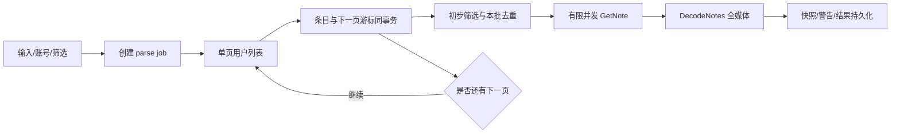

# 多账号与笔记解析

## P3a 已实现边界（2026-10-05）

- `modules/parsing` 为批量/用户发现作业，`notes` 保留单条与统一快照模型；两者通过同一 XHS session 请求配额访问 API（全局 2、每账号 1）。`parse_groups → parse_sources/parse_items → parse_item_sources` 独立记录来源，详情、笔记投影及 item 结算同事务，run_version/状态守卫拒绝迟到写入。
- 支持完整链接/24 位 ID、多行分享文本、UTF-8 文本导入、xhslink.com/cn 有界无 Cookie 展开。每批 1 MiB/最多 1000 个来源，队列最多 100 个等待作业，2 个后台作业控制器，详情处理 1～16 个有界 goroutine；通过 session 配额限制实际网络请求。
- 输入及笔记请求参数 DPAPI 加密，AAD 关联来源/作业/笔记/账号及凭据版本；普通 DTO 不返回密文/原输入/token。固定账号或按来源分配启用账号池，来源内分页和详情沿用该账号，不自动换账号/凭据。失效、受限、限流暂停作业；Cookie 变更需新建作业。
- 用户发布笔记单页读取，轻量列表独立适配，使用每条笔记自己的 token/source 补详情。每页 items/来源关联/下一游标同事务；页面处理完才继续发现，防止无限内存积累。跨页/来源同笔记只解析一次，保留实际来源位置和页码；游标循环/缺失/空页仍 has_more 明确报错，保留已提交检查点。
- 支持页/笔记数量上限、类型/日期/标题/LivePhoto 筛选、同账号版本详情缓存（10分钟默认）/强制刷新/只用缓存、可选保存 raw。筛选依据完整详情，缺发布时间不按 0 丢弃；已解析但被筛除的快照仍可追溯，批量结果标 Skipped。未保留 raw 时快照明确 raw_available=false，Raw API 报不可用。
- 暂停/取消先提交状态再取消 I/O，成功结果保留；重启标 Interrupted，继续使用加密输入与已提交游标，成功项不重复请求。失败重试仅复用原作业重置失败来源/项。达到限额为 Limited，需扩大范围后新建作业（已有详情可命中缓存）。
- 前端解析页三入口及懒加载结果页已接真实绑定；显示作业计数、来源账号、各用户页数、失败/限额原因、来源展开。当前活跃页面有限频率查询状态，完整统一解析事件/诊断、账号自动切换冷却和高级查询留后续阶段。

## P2b 已实现边界（2026-10-04）

- `modules/notes` 持有单笔记作业；`adapters/xhs` 负责既有详情接口/Pretty；`storage` 负责投影和不可变快照，`bridge/NoteService` 只做生命周期保护与调用。
- `StartParse` 输入完整链接/ID、固定账号（可留空使用默认）、request_id；返回持久化作业。2 个解析 worker、32 个等待槽，45s 作业超时。`GetParseJob/ListParseJobs/CancelParse` 查询/取消；页面切换不停止后台工作。重复 request_id 不重复执行，不能改作业目标或明确指定的账号。
- 详情沿用 `GetNoteByID → DecodeNotes`；保留原链接的 token/source、不调用 GetVideoURL。可用笔记附带全部字段路径 warnings；未找到目标笔记则失败，不用响应里其他笔记替代。
- 快照原子保存作者/笔记投影、全部 Pretty、原始响应、SHA-256、warnings、解析账号/凭据版本、解析器版本、完成状态。取消后或账号版本变更后，迟到结果不能提交。无作者 ID 时允许空关联；LivePhoto 保留图片属性及对应 motion_streams。
- 账号校验与解析共用版本化 client/lease；缓存命中仅查询元数据，不重复解密 Cookie。替换/禁用/删除立即取消旧 lease，引用归零才 Close。Runtime 取消并等待命令/worker，再关闭会话和数据库。
- `ListNotes` 为时间+ID 游标，默认 50、最大 200；详情全部候选按需获取。`GetNote/GetSnapshot/ListSnapshots/GetRawSnapshot` 支持当前与旧快照；最近快照上限 200，最近作业上限 100，批量阶段再补分页。原文不混入普通 DTO。
- 当前原始响应始终保留；访问 token/source 只保存在等待作业内存，不落盘链接、不日志输出。退出/重启将未完作业标 Interrupted，需重新输入链接，暂不自动恢复请求。P3 加入加密访问来源与持久化批量队列，P4 用于 URL 刷新。
- 前端只在解析页存在活动作业时每秒查询状态，重新进入页面同步一次；笔记库进入时重新取当前投影。P2c 的 EVT-01 已接入下载事件。离线验证使用 `desktopcheck parse/inspect`；线上请求只由用户明确发起。需要在应用中查看导入记录时，关闭应用后给 CLI 的 `-data-dir` 指定可执行文件旁的 data 目录。

## 多账号 Cookie

账号支持新增、重命名、更新 Cookie、验证、禁用、设为默认、删除。用户粘贴 Cookie 文本，后端完成语法/必要字段校验，再用 `GetMe` 验证登录用户；本地保存和远端验证是两步，验证失败也可保存为待修复账号。

应用封闭状态建议显式 int8：Unknown=0、Unchecked=1、Valid=2、Expired=3、Restricted=4、Disabled=5、Error=6。网络暂时错误不应判成 Cookie 过期；保留 last error、上次验证时间和当前校验中的瞬时标记。

### 凭据与 client 管理

- 普通账号 DTO 只含名称、用户 ID、状态、是否默认、Cookie 是否存在、版本、校验时间；禁止账号列表返回 Cookie 原文。
- 首发使用 Windows DPAPI 保护 secret_blob；封装 `SecretStore`，其他平台以后补平台适配。不能将内置固定密钥当加密，不能因保护失败而无提示落盘明文。
- Cookie 只在 accounts 管理器获取 lease 时解保护。导入/更新会增加 `credential_version`，client 缓存键为 account_id + version + network profile。
- 每个账号独立 `xhsapi.Client`/session。`Acquire` 返回带 Release 的 lease，运行中 lease 归任务释放；新版本替换旧缓存，旧 client 等引用归零后 Close。
- 禁用/删除不接新工作；删除会暂停相关待解析任务并清除秘密。正在使用旧 lease 的工作由管理器取消其账号作用域 context，待退出后关闭，不在有请求时直接 Close transport。
- 网络配置改变时同样轮换 client；应用退出关闭全部 client，并检查每个 lease 已释放。原有 GetMe/bootstrap/session Cookie 合并规则由 xhsapi 处理。
- 初版不另行假设存在 session 导出 API。若确需保存服务端 Set-Cookie 后的新状态，先增加受控导出能力与测试，再由账号服务加密保存；不能从私有字段取值或把原 Cookie 错当最新 session。

### 账号选择与失败策略

默认策略为固定账号：用户选择或默认账号贯穿作业，便于重现响应不全的问题。可配置固定账号、按用户来源分配、受控轮询三种 int8 模式；同一 note 详情请求不并行跨账号重复请求。

受控切换仅在明确登录失效/账号不可用时生效，记录原账号与新账号、原因、attempt；不因某个响应缺少流便无限试所有账号。限流/风控进入冷却并回传原因；必要时任务等待用户更新 Cookie。已下载公开 CDN 文件不因解析账号失效而一律取消。

## 三种解析入口

| 模式 | 输入 | 行为 |
| --- | --- | --- |
| 单笔记 | 完整笔记链接或 24 位 ID | 解析访问参数 → GetNote/GetNoteByID → DecodeNotes → 持久化快照 |
| 批量笔记 | 多行链接、分享文本中链接、导入 UTF-8 文本文件 | 提取输入、验证、同 note 去重、保留全部来源、有限并发详情请求 |
| 用户笔记 | 一个或多个用户主页链接/用户 ID | 读取用户信息 → 逐页 GetUserNotes → 条目入库 → 按筛选结果拉详情 |

用户模式首版抓取用户发布笔记。喜欢/收藏可作为来源 int8 配置扩展，必须 UI 标明受账号访问权限影响；不把不可访问空列表等同用户没有内容。

`xhsapi.ParseNoteURL/ParseUserURL` 已支持完整域名链接/ID，保留 xsec_token/source。`xhslink` 短链接另在输入适配器展开：有限次数重定向、超时、循环检查、允许域校验；短链展开不携带账号 Cookie，最终合法完整链接再进入现有解析。不能假装现有 ParseNoteURL 已支持短链。

## 用户分页与详情补全

- 列表 `notes` 是轻量结构，不直接假设等于 feed `items.note_card`。xhs 适配层增加 UserNoteSummary 转换，保留 note_id、type、author、token/source 和可用发布时间。
- 用户 token 与笔记 token 不混用。详情链接优先使用该列表笔记自身 xsec_token/source；缺失则明确按现有 API 允许的参数尝试，不伪造 token，也不向另一账号无条件复制访问上下文。
- 使用单页 `GetUserNotes`，而不是一次 CollectUserNotes 将所有 raw 响应留内存；游标按用户来源分别保存。重复游标、空页、has_more 缺游标、页数/数量上限均明确结束或报告错误。
- 每页成功事务提交后再推进 next_cursor；崩溃后重复该页依赖唯一 note_id/来源约束幂等，不漏页、不累计重复。
- 列表初筛有证据的字段；发布时间未知时不能当作 0 而误过滤。日期筛选不能以列表一定按时间排列为前提提前停止，除非以后真实验证该来源的顺序保证。
- 详情队列设置有界缓冲和背压；暂停时不继续分页发现无限笔记。默认解析并发 2、每账号详情并发 1，参数可调。

## 筛选与缓存配置

解析配置包含：来源、指定账号/切换策略、数量上限、页数上限、发布时间区间、笔记类型、是否包含 LivePhoto、标题关键词、缓存策略、是否存 raw、详情并发、每账号速率/间隔、重试与超时。

首版用户分页默认最多 100 页、无限笔记数限制值为 0，但由页数限制约束；达到上限要显示「达到配置上限，仍可能有更多」，不能显示完整采集成功。用户主动配置更大范围，仍采用逐页背压处理。

缓存模式 int8：UseFresh=1（默认有效期 10 分钟）、ForceRefresh=2、CacheOnly=3。缓存按详情快照和请求账号上下文判定，不能将列表条目当完整详情。媒体 URL 可能短期失效，命中解析缓存不能保证下载可用。

一条笔记可能有完整文本但部分媒体缺字段：DecodeNotes 返回的可用结果照常保留，warnings 含 note/字段路径/原因。上游未返回的清晰度不补造；UI 显示当前账号响应提供了哪些候选，不宣称全平台绝对完整。

## 解析任务与结果

- StartParse 快速返回 job_id；job/source/item 状态持久化。状态复用 jobs 基础状态，解析 item 另用 Pending/Resolving/Succeeded/Partial/Failed/Skipped 等 int8。
- job 返回总发现数、完成数、部分成功数、失败数、跳过数、正在处理来源、下一页状态和是否有未知总量。
- 单项失败不终止整批；用户来源失败不丢前面已提交结果。全成功/部分成功/全失败分别汇总，重试只处理失败项。
- 同一批重复输入只执行一次详情请求，但保留全部 input index/source；不同批同 note 可以引用已有 fresh snapshot。
- 取消停止新发现和排队详情、取消正在请求，保留成功数据；暂停保留未完成队列。页面离开不控制任务生命期。
- 不自动下载解析结果。用户查看/筛选后调用 BuildDownloadPlan；可在用户作业创建时明确勾选「按此配置自动加入下载」，由服务端持久化意图再处理。一次选择 N 条笔记会生成 N 个单笔记下载任务，使用 batch 关联同次提交；不会将它们合成一个执行任务，下载并发设置也不改变解析并发。
- 原始响应仅保存 body；Cookies、请求头、鉴权 token 不混入可导出的 Pretty。可复制的带 token 分享链接只在用户明确操作时返回。

## 验收结果

1. 两个 Cookie 对应独立 session；更新/禁用其中一个不影响另一个。
2. 同一文本中重复链接只请求一次，并能追踪每个来源位置。
3. 用户多页条目不充当详情；详情调用使用其自身 token/source。
4. 任意 codec/scene、多流、多图、LivePhoto 混排完整保留；WebDft 与链接去重沿用当前测试。
5. 解析中断后恢复不会丢页或重复累计；部分失败结果可查看并重试。
6. 页面显示警告、来源账号、解析时间和限额结束原因，不伪报完整性。
