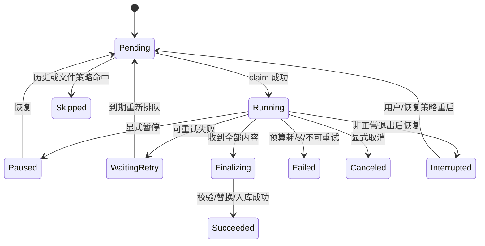

# 下载配置、任务系统与历史去重

## P2c 已实现边界（2026-10-04）

- `modules/downloads`：纯 Planner、不可变配置、单笔记任务/有序项、调度/状态/基础历史过滤、有界进度 Hub。`storage/download_repository.go` 和集中 downloads SQL 原子写任务/文件/历史/claims/journal；`adapters/mediahttp` 流式 HTTP 与受约束文件操作；app 管理启动、停止和数据目录独占锁。
- 当前选 Best：主视频首个有地址流、每图首个有地址 variant（沿用 Pretty 的 WebDft 排序）、每张 LivePhoto 首个有地址动态流。静态/动态同图相邻，`representation.image_index` 是文件命名使用的 1 起始顺序。支持封面、文本、Pretty、raw、结果 manifest 开关；辅助项放在媒体之后。
- 命名清理 Windows 非法字符/设备名并保留 ID/短身份摘要；按作者/笔记分目录。通过 Go 1.26 `os.Root` 约束文件操作，防止路径/链接逃出输出根。Windows Root.Rename 使用相对目录句柄的替换 API，下载前不删除/truncate 正式文件。
- 配置支持 Overwrite（默认）/SkipExisting、DedupOff/SameOutput、强制忽略历史、严格 SHA-256、每地址额外重试 0～5/总预算 1～64（默认 2/12）、失败后继续/终止。全局下载位置未设置时使用可执行文件旁 `data/downloads`；设置页和单任务配置可覆盖，空任务目录由后端继承当前全局目录。保存“未设置”语义，不把派生默认位置作为绝对路径写入偏好，移动程序后默认位置随 data 移动。本阶段固定连接 10s、响应头 15s、空闲读取 30s、每主机最多 4 连接，普通 CDN 使用独立标准 HTTP client，不修改 API 的 Chrome_152_PSK。
- 调度最多 32 个活跃笔记，设置默认 4，向下调整只停止新派发；等待队列在 DB，最多 1000 个排队任务。FIFO，一条笔记的多个 task 经 note_claim 串行；同一 task 逐项执行，路径 claim 和单任务 Running/Finalizing 部分唯一索引兜底。基础退避仍占当前笔记 worker，公平老化/退避让出配额/限速留在 P4。
- 流式写入使用可复用 256 KiB buffer，校验长度、媒体魔数、SHA-256；拒绝 HTML/JSON。选中流主/备用 URL 精确去重并受尝试预算约束；请求和重定向不携带 Cookie。读写/响应体/Root/临时文件/计时器由 executor 就地释放。
- 完整文件先关闭并 Sync，写 Finalizing journal，再替换、原子结算文件/笔记计数/历史和释放 claim。重启严格核对正式文件或临时文件摘要后补结算；无有效证据改 Interrupted 重新下载。已有成功项保留。暂停/取消等待 worker，未完成 part 清理，恢复从该项重新下载；尚无 Range/分段续传。DB 提交异常留下的 Finalizing 项要求重启核对后再恢复。
- 首次执行创建一条笔记历史，RetryFailed/Resume 使用原 task/history。历史过滤逐项核对同输出根的真实文件，size/mtime 一致时快速复用，否则或 StrictHash=true 时流式校验摘要。缺文件重新下载；SkipExisting 不计为已验证资产覆盖。媒体身份目前保守地绑定 snapshot+候选 URL/规格，跨快照不误判同规格多流；跨快照 strong 身份及 AnyValidCopy 留在 P4。
- manifest 不含 Cookie 或 URL，列出前序文件的规格、静态/动态关联顺序、结果/校验/失败；作为最后一个项执行。取消或提前终止时可能尚未写清单，以数据库历史为准。Pretty/raw 是用户选择的完整元数据输出，仍保留其媒体 URL。
- typed `downloads:changed`：字节事件 200ms 合并，状态事件唤醒；待发布最多 256 个 task，64 个 replay batch，溢出触发重读。前端 root 唯一订阅，先监听再读 ActiveSnapshot、按 run/sequence/revision 应用缓冲/重放；每 5s 小型 checkpoint 修复末尾事件丢失。bytes 不每次重查列表；落库 checkpoint 为 1s 和项结算。实时任务总量缺失时只显示已传输字节与已结算项，不伪造总字节。
- 下载/历史懒加载页、配置预览 Drawer、任务文件 Drawer、目录定位、note ID/状态过滤已接真实绑定。作者/日期/多条件高级查询、大列表虚拟化、原生交互/长期故障验收分别留在 P3～P5。

## 处理链路和模块边界

```text
笔记完整快照
  → 纯 DownloadPlanner（配置校验、候选筛选、目标路径、资产身份）
  → 计划预览（选中/跳过/警告/大小估计）
  → CreateDownloadTask / CreateDownloadTasks（每条笔记一个 task，批量只分组）
  → NoteScheduler（笔记并发配额、账号限速、公平排队）
  → NoteExecutor（当前笔记内按 item_sequence 串行执行）
  → ItemExecutor（历史明细/claim → 流式请求 → 临时文件 → 校验 → 替换）
  → 原子结算下载项、更新笔记历史/进度 → 本笔记下一项或任务结算
```

Planner 不联网、不访问 DB、不创建文件，输入一条 NoteSnapshot + DownloadConfig，输出该笔记有确定 item_sequence 的 PlannedItem 列表与 warnings。批量规划返回多个单笔记计划。历史判断和文件存在性在执行阶段复核；预览只提供当时估计，不能作为最终跳过依据。

原有 xhsapi 继续返回全部媒体候选。业务的「最佳/全部/自定义」由 planner 实现，不能回头裁剪 NoteVideoInfo.Streams 或图片 Variants。

## 下载配置契约

`DownloadConfig` 带 schema_version，分为 media、output、dedup、execution、network、integrity 配置组。配置解析后执行后端 Validate/Normalize，生成不可变任务快照及 canonical hash；UI 表单只负责交互，不能成为唯一校验处。

| 配置组 | 支持项目 | 初始默认 |
| --- | --- | --- |
| 媒体范围 | 视频主内容、图片、视频封面、LivePhoto 静态图/动态流、文本、Pretty JSON、原始响应、manifest | 主视频/图片、LivePhoto 两部分、Pretty 与 manifest 开启；封面/独立文本/raw 可选 |
| 视频选择 | Best、BestPerCodec、All、Custom；包含/排除 codec 或 codec_group；容器；长/短边范围；FPS 范围；HDR 筛选；指定候选 ID；未知属性处理 | Best，使用现有质量排序的第一个有 URL 候选，不固定 EF4/EF5/EF7 |
| 图片选择 | 每图 Best、All、指定 scene 列表、指定候选；同 scene 多候选；图片位置范围；格式筛选；是否保留未知 scene | 每图 Best，WebDft/WB_DFT/WEB_DFT 优先，原始图片顺序保持 |
| LivePhoto | Both、StaticOnly、MotionOnly；动态流复用视频选择；静态图复用图片选择 | Both；按每张图片建立静态/动态配对记录 |
| 质量回退 | 等价候选/备用 URL 切换；允许降级；降级范围、未知规格处理 | 先尝试选中流全部非重复主/备用 URL；不静默跨清晰度降级 |
| 输出 | 根目录；按作者/笔记分目录；文件/目录模板；扩展名；长度限制；缺省变量；metadata 格式 | 用户选定根目录；`{author_name}_{author_id}/{note_id}_{title}/` |
| 命名 | note_id、title、author_id/name、published_date、media_kind、image_index、codec、dimensions、fps、variant_key；索引宽度 | 媒体名含 image_index 或 video 标记、规格和短 variant_key，防止不同流同名 |
| 已存在文件 | Overwrite、SkipExisting、KeepBoth；临时文件保留策略 | Overwrite；完成新文件前保持旧文件可用 |
| 历史过滤 | Off、SameOutput（同输出根有效文件）、AnyValidCopy（任意有效副本）；strict hash；升级质量只补缺；强制重下 | SameOutput；按资产判断已成功且文件有效，ForceRedownload=false |
| 并发 | 同时执行的笔记数、每主机连接数、每账号 API 数；每笔记下载项始终串行 | 笔记并发 4；每笔记同时执行 1 项；每主机连接上限 4、每账号 API 1 |
| 单项连接 | 可选 Range 分段连接数；只作用于当前下载项，独立于笔记并发 | 默认 1，允许 1～4；不是同时下载同一笔记的多个项 |
| 任务控制 | priority、开始时暂停、完成后动作、当前项失败后继续下一项/终止本笔记、启动自动恢复 | 普通优先级，失败后继续下一项；不自动终止其他笔记；重启后 Interrupted 待手动恢复 |
| 网络 | 代理、连接超时、响应头超时、空闲读超时、单文件最长时间、全局/单文件速度限制、账号 API 间隔 | 连接 10s、响应头 15s、空闲读 30s；总时限/带宽限制 0 表示不限制 |
| 重试 | 每 URL 重试次数、总尝试预算、指数退避、抖动、Retry-After、备用 URL 策略 | 每 URL 额外重试 2 次，单文件总尝试上限 12；基准 1s、上限 30s |
| 地址刷新 | 是否刷新过期详情、次数、匹配原选规格/身份、明确允许降级 | 允许刷新一次；匹配失败则报错，原计划不静默换媒体 |
| 校验 | 长度、内容类型/魔数、SHA-256、服务端有提供时校验 hash、重用文件验证 | 长度/类型与本地 SHA-256 开启；上游 hash 必须与所选资产对应才使用 |
| 保存辅助数据 | UTF-8 文本/Markdown、Pretty、raw、manifest、attempt 诊断导出 | 任务结果 manifest 开启；不导出 Cookie/请求头，签名 URL 可选保留 |

内部策略/模式是 int8；codec、scene、容器及模板变量是开放字符串。Custom 引用 snapshot 内稳定 candidate ID，不使用数组下标当跨快照身份；配置无法匹配任何媒体时预览明确列出原因，不能直接创建空成功任务。

配置名必须体现单位：`max_concurrent_notes` 默认 4、允许 1～32；每条笔记下载项并发固定为 1，不提供可调的「每任务文件并发」。解析并发另为 1～16；`connections_per_item` 为 1～4，主机连接上限单独校验，不能把 HTTP 连接数直接等同笔记数。保存高级设置时后端拒绝负数、溢出、无效模板、不可写目录；上限以后可通过实测调整并记录。

媒体「原图/原始」只指服务端确实返回的对应资源，不通过改写签名 URL、猜后缀或去掉 query 合成高质量地址。格式筛选只选择已有候选，不等同转码。独立音频仅在响应真实提供可下载独立资源时展示；基础版不从混合 MP4 中承诺抽音轨。

LivePhoto 基础导出为静态图片 + 原始动态视频 + 配对 manifest，保留原图片 index/ID。此能力不等同可导入 Apple Photos 的 LivePhoto 容器；合成/转码未来独立模块，不阻塞纯 Go 下载。

封面只使用响应里已有可用 URL。只有 first_frame_file_id 而没有可靠 URL 时返回「无可用封面地址」，不增加自动 GetVideoURL 请求。

## 候选、URL 与资产身份

区分三件事：候选表示一种可选媒体记录；候选的多个 URL 是同一流的传输备选；历史资产身份用于判断是否已下载同一资源。

1. 图片沿用 xhsapi 完整 URL 精确去重及 Sources 合并，WebDft 优先。视频沿用既有保守跨源合并，不把同 codec/分辨率的多个流强行压成一条。
2. 一个已选视频流所有 CandidateURLs 去除空/精确重复，保持主地址到备用地址顺序；备用 URL 不生成多份下载文件。
3. 不移除签名 query，不把 host/参数不同地址擅自当同一个 URL。全量模式包含全部不同图片 variant/视频 stream，不重复输出原始来源别名。
4. 资产 key 包含 note_id、media_kind、源媒体 ID/file_id、representation 身份（codec_group、格式、宽高、FPS、码率/stream_type 等有依据字段）及可信内容版本。优先使用上游明确资产标识/对应 checksum；文本/JSON 资产按内容摘要区分版本。
5. 只有「源标识 + 规格 + 内容版本」足以唯一识别时标 Strong。遇到同规格多条流、缺少版本/标识或冲突无法区分时，使用 snapshot/candidate/完整 URL hash 生成 Weak key；宁可重新下载，也不能误跳过另一条流。
6. weak key 可用于同一快照/同一输入的精确幂等，不能用于跨快照、跨签名刷新直接智能去重。刷新后重新匹配存在歧义时报告候选变化，而非随便挑第一个。
7. URL/token 与媒体身份分离；授权链接变更不会单独改变已证实 strong 资产的内容身份。记录身份依据、source snapshot 和实际下载结果，方便排查。

不知道格式/宽高/FPS 时使用 Unknown/null，不能给伪规格参与质量比较。排序显示服务器来源信息，默认只是基于已返回证据的最佳可用候选。

## 任务模型与状态机

两层：`DownloadTask（单条笔记）→ DownloadItem（该笔记的有序下载项）`。一条笔记可以有多个图片变体、视频流、LivePhoto 静态/动态和辅助输出，但它们都属于同一个 task，按顺序一个接一个下载。笔记是队列、并发、暂停/取消/重试、列表与历史的管理单位，item 是任务内部的执行/校验/恢复明细。

批量提交可选 `DownloadBatch → 多个 DownloadTask` 关联同一来源，提供批量操作和汇总；batch 本身不作为下载任务、不占独立并发槽。相同笔记再次下载创建新 task；同一 task 的失败项重试复用原任务和历史。

顺序由 planner 固定并落库：选中的视频流按质量/选择顺序；图片按笔记原顺序，同图变体按候选优先级；LivePhoto 静态项与对应动态项相邻；其他辅助输出置后，结果 manifest 在任务结算时更新。恢复以当前未结算 item_sequence 为准，不因为后续项 URL 可用而越过当前项。当前项成功、明确跳过或重试预算耗尽且允许继续后，才能推进下一项。

示例：笔记 A 有 A1/A2/A3，笔记 B 有 B1/B2，并发为 2 时，允许 A1 与 B1 同时下载；A1 结束后执行 A2，B1 结束后执行 B2。任何时刻都不允许 A1 与 A2 同时执行，即使某一笔记包含更多下载项。

基础 JobState 显式 int8 编号：Unknown=0、Queued=1、Resolving=2、Running=3、Paused=4、WaitingRetry=5、Succeeded=6、Partial=7、Failed=8、Canceled=9、Interrupted=10。终态不因迟到事件回到 Running；再次重试产生新 attempt 和 revision。

下载项单独 int8：Unknown=0、Pending=1、Running=2、Paused=3、WaitingRetry=4、Succeeded=5、Skipped=6、Failed=7、Canceled=8、Finalizing=9、Interrupted=10。Finalizing 阶段校验/替换/提交是短而受控的过程；取消不能破坏已经提交的成功结果。



图只示核心路径；Pending/Paused/WaitingRetry 也可取消，Finalizing 失败进入 Failed，所有迁移在模块中集中校验。桥接不得直接赋状态。

笔记聚合规则：所有下载项成功/合理跳过为 Succeeded；有成功且有最终失败为 Partial；全失败为 Failed；用户取消本笔记为 Canceled，已成功文件保留。历史另保存 fulfilled_items/未满足项，不能把 SkipExisting 的未经核对文件当完整覆盖。暂停时停止本笔记下一项、取消当前可中断 I/O并等待 executor 退出，再确认 Paused；其他笔记继续运行。当前项的单次请求取消原因区分暂停、取消、关闭和网络失败。批量操作逐个作用到成员笔记任务，不引入另一套批次状态机。

RetryFailed 将需要重试的项重新排队，恢复指针设为原顺序中最早的未完成项；已完成项不重下，也不能重复累计成功/失败计数。沿用原 task/history，清除本次未结束过程的 finished_at_ms 并提升 revision，attempts 保留每次失败/重试轨迹。只有新的重下请求才产生新 task/history。

## 并发调度

- 有界笔记 worker pool + 有界 task dispatch queue，调度的是 task_id；每个 NoteExecutor 在自己任务内串行调用 ItemExecutor，不另起独立文件队列。不为每条笔记/候选永久起 goroutine，队列权威在 DB。
- 获取全局笔记并发槽与本 note_id 的执行权；同一笔记不同 task 也串行排队。主机连接数、单项分段连接数、账号 API 配额/速率是另一组资源约束，不改变一笔记同时最多执行一项。
- 调度公平以笔记为单位：按 priority 排队，同优先级 FIFO 并使用等待老化；运行中的笔记正常连续执行其下载项，结束/暂停/进入退避后才腾出笔记 worker，不将后续文件拆出来和当前项并行抢槽。
- 热更新笔记并发向下调整只减少新笔记派发；当前笔记继续其串行任务，完成/暂停/退避后归还配额。向上调整可开始更多排队笔记，不增加同笔记内部并发。
- 限速 token bucket 使用可取消等待；当前项重试由集中定时队列管理。退避时关闭本次 I/O并释放笔记 worker/全局执行槽，保留当前项顺序及 note 所有权，到期再获取执行槽并重试当前项；同笔记的下一项或另一 task 不得趁机开始。暂停/最终结算后才释放 note 所有权，等待占用时不占 worker。
- asset_claims/target path 唯一约束兜底多个任务竞态；内存只做优化。占用冲突进入等待/合并显示，不误报最终失败；恢复时回收上次进程的占用。
- worker 完成/错误/取消所有路径都按所有权规则释放执行槽、item claim、lease、body、file、timer；笔记的 note_claim 由 NoteExecutor/调度器在暂停/最终结算时释放，重启统一回收。用状态迁移及 defer 明确归属，不捕获 panic 后继续虚报成功。

## 流式下载、覆盖和恢复

媒体适配器暴露带 context 的 streaming response，Response.Body 由 executor 关闭；不复用把整个 body 读入 `[]byte` 的 API transport。优先验证普通 CDN 的 streaming HTTP；如果目标站确需既有 TLS profile，建立独立 streaming tls-client 适配并复用 profile 设置，不修改 API transport 接口和已有请求行为。

1. 规划目标路径：清理 Windows 禁止字符/保留名/尾部点空格，限制长度，保留稳定 ID，避免 title 相同冲突；路径必须在所选 root 内，不跟随逃逸 root 的 symlink/junction。
2. 在目标目录创建 `.part.<file_id>`，保证最终替换同文件系统。默认覆盖时不先 truncate/delete 原文件，下载失败仍保留旧文件。
3. 流式复制（初始 256 KiB buffer 池，最多 active worker 数量），同步更新 SHA-256 与进度计数；读取超时由连接/空闲机制控制，不能把整个大文件固定为 API 的 15 秒超时。
4. HTTP 200 不等于媒体成功：检查类型/魔数，拒绝 HTML/JSON 风控页；校验 Content-Length、已知流大小及 checksum，留意压缩/Range 下长度语义。CDN 要求字节稳定，请求 identity encoding，不混淆压缩后大小。
5. 下载完成进入 Finalizing，关闭/flush 临时文件，记录 finalize journal（file_id、目标、临时路径、期望大小/hash、配置版本），再执行平台安全替换。Windows 用经过验证的替换实现，不用「先删除目标再 Rename」冒充安全覆盖。
6. 替换完成后 repository 一次提交成功/历史；journal 成功后清理。DB 提交失败保留 journal，启动时用 hash/文件身份核对完成情况后补提交。
7. 不具备足够证据的崩溃恢复不能自动认定成功，应标 Interrupted 并说明需要重试。取消默认删除本任务 part；暂停默认保留 part；保留/清理均受配置控制，不删除既有正式文件。

断点恢复配置：发送 Range + If-Range，记录稳定 ETag（弱 ETag 不作一致性凭据）/Last-Modified/长度；收到符合预期的 206 和 Content-Range 才 append。收到 200、范围不匹配、validator 改变则清空 part 后重下；416 只有校验已下载完整内容时才视为可完成，否则重启请求。

换备用 URL 或重新解析 URL 时，不跨地址盲目拼接 part：只有确认相同内容及兼容 validator 才续传，否则从零下载。multipart range 分段模式在串行 Range 完成后实施；服务器确实支持、内容可验证、最终段覆盖完整且 hash 正确才启用，自动退回单连接，进度不能重复累计重传字节。

重定向次数有界，并重新校验协议/目标域。Cookie 仅在明确允许的站点 API/媒体域且确有需要时附带；不能向任意 CDN 或跨域重定向转发全部账号 Cookie。Referer/User-Agent 等按媒体适配器配置，不把任意用户 header 当无限覆盖入口。

## 失败分类、备用 URL 与刷新

- 可重试：网络断开、超时、429、部分 5xx；尊重 Retry-After（转换为 next_retry_at_ms），指数退避带抖动，总预算必须有界。
- 401/403/404：可能授权/签名过期或资源删除；先尝试同选中流可用备选，必要时一次 GetNote 重新解析。不是每种 403 都账号过期，不能无限刷新或立即全账号轮询。
- 刷新匹配：用 strong asset 身份/选中规格找到唯一对应记录；原 selected snapshot 保留，实际刷新快照单独关联。媒体已变更、匹配歧义或缺失则明确失败/等待用户确认新计划。
- 磁盘满、不可写目录、校验持续失败、非法媒体响应归类为本地/内容错误；当前项失败默认结算后继续本笔记下一项，可配置 stopOnError 终止本笔记。批量中的其他笔记继续，失败不能隐式取消整个分组。
- 同规格流的备用地址尽数尝试但受总预算限制；预算截断时显示尚有多少候选未尝试，避免声称所有 URL 都失败。

## 笔记历史、智能补缺与默认覆盖

一个 history 记录一次笔记任务，主列表显示 note/author、任务状态、已满足/失败/跳过项数、输出目录和下载时间；展开该记录查看有序的 history_files 明细。第一次开始任务时建记录，随逐项结算更新；失败/取消也有笔记级历史，失败项重试更新原记录，显式重新下载另建记录。

管理单位是笔记，但不能只因该 note_id 有历史就跳过整条。根据本次完整下载计划逐项核对历史成功明细与磁盘：全部满足可整体完成为「已下载」，部分满足则仍创建/执行该笔记任务，串行跳过已满足项、只下载未满足项。不同清晰度、编码或 LivePhoto 动态项必须各自有覆盖证据。

判断顺序必须一致：

```text
ForceRedownload=true？ → 绕过历史与历史资产过滤
否则 → 同次提交的重复笔记/相同下载项去重
     → 按笔记查询其历史中的 strong 资产成功明细
     → 按 SameOutput/AnyValidCopy 范围核对磁盘实际文件
     → 有效则 Skipped，并返回历史/路径/理由
     → 无有效匹配则申请 asset/path claim
     → 检查目标已存在文件策略（默认 Overwrite）
     → 串行下载并替换、更新本笔记 history 及 item 明细
```

- 默认 SameOutput 只有当前输出根中同资产成功且文件仍存在、校验有效才跳过；改输出目录应下载新副本。
- AnyValidCopy 明确允许复用其他目录的有效副本，UI 提示文件位置；不是只看到 note_id 有历史就整条跳过。
- 某笔记历史整体为 Partial/Failed/Canceled，不妨碍其中确实成功且仍有效的下载项参与补缺判断；查询依据是成功明细，不要求父记录必须全部成功。
- 视频只下载过 720p，改为 2160p/另一编码需要补缺；LivePhoto 只有静态图时继续补动态流；全部模式只有某些 variant 成功时只补未完成。
- 不同备选 CDN URL不作为不同资产重复下载；不同规格/不同流候选不能因 URL相似或 note_id 相同而被过滤。
- weak 身份不能跨快照判相等。签名地址变化本身不等于内容改变，但只有足够 strong 证据才利用这个规则。
- 文件不存在、大小改变、hash 不符、内容不符、无法访问时历史不命中有效过滤；记录 Missing/Changed/Corrupt/Unknown 状态和验证时间。保存历史时记录实际大小、mtime_ms、checksum；严格模式每次核对 digest，快速模式先 size/mtime，证据变化再重新校验。
- ForceRedownload 为该笔记创建新任务和新笔记 history，旧记录保留；Overwrite 默认依然生效。RetryFailed 在原笔记任务/历史中按序处理未满足项，不重下成功项。关闭智能过滤与强制重下是两个显式设置，任务快照记录实际生效值。
- SkipExisting 只依据文件策略跳过时，不能伪造「同资产下载成功」history；返回不同 skipped reason。目标相同的任务同时提交时，以 claim 和文件状态复核保证不会互相破坏。

## manifest 与进度

每个笔记 manifest 记录 note/author/snapshot、下载配置版本、候选规格、LivePhoto 配对、成功/跳过/失败文件及原因、实际路径/大小/hash、时间戳。成功文件不记录原始 Cookie；签名 URL 默认不进入面向分享的 manifest。

进度以笔记汇总，字段含 task_id、note_id、current_item_id?、current_item_sequence?、revision、state、planned_items、successful/failed/skipped/fulfilled_items、completed_bytes、transferred_bytes、total_bytes?、bytes_per_second?、eta_ms?、updated_at_ms；可附当前项进度。completed_bytes 用于已完成/已复用项覆盖，transferred_bytes 是本次实际传输量，两者不能混用。total 未知时展示字节及项数和不确定进度，不能填 0 后算百分比。

事件按活跃笔记合并，每 200ms 最多一次批量推送，载荷带该笔记当前项；状态变化立即触发并在批量出口合并。纯 bytes checkpoint 默认每 1s 或增加 4 MiB 时写库，下载项结算/顺序推进/笔记历史更新同事务立即写；落库与事件频率分离。重传计数单独记录，业务完成字节不因重试反复增大。

## 完整交付判定

全配置、笔记并发/笔记内串行、单项 Range/可选分段、笔记级暂停取消恢复、备用与过期刷新、默认安全覆盖、笔记历史与逐项补缺、实时汇总进度和顺序恢复全部有验收项，才算下载系统完成。阶段首版只支持 Best/单连接时必须在进度中标明剩余范围，不能把「可下载一个视频」当作完整实现。
